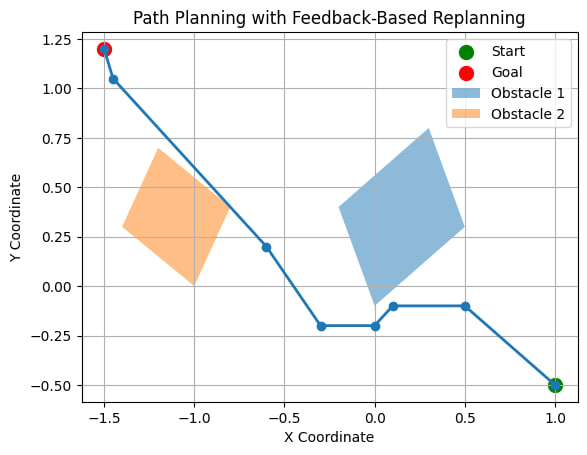
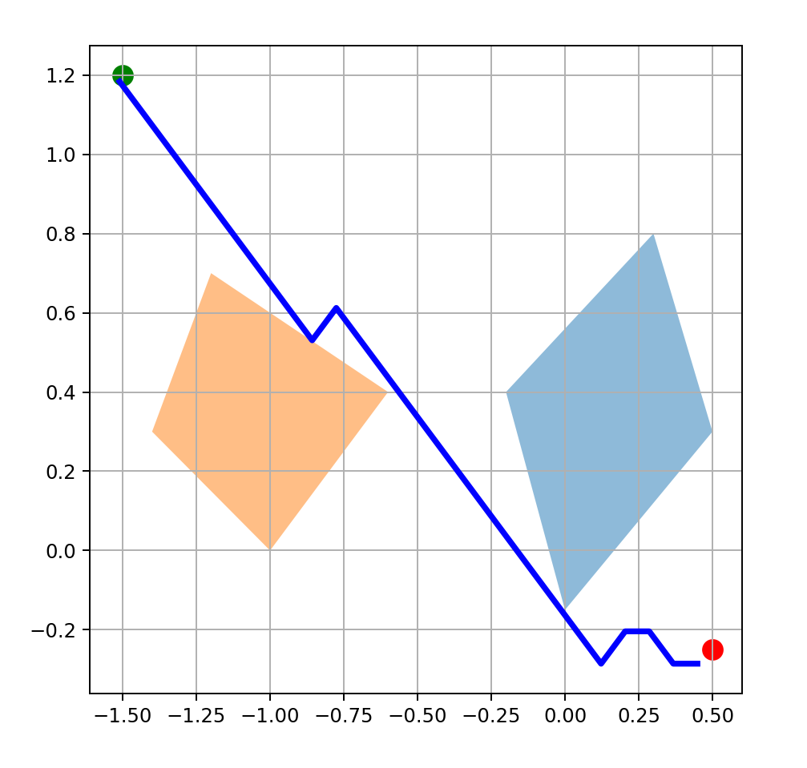
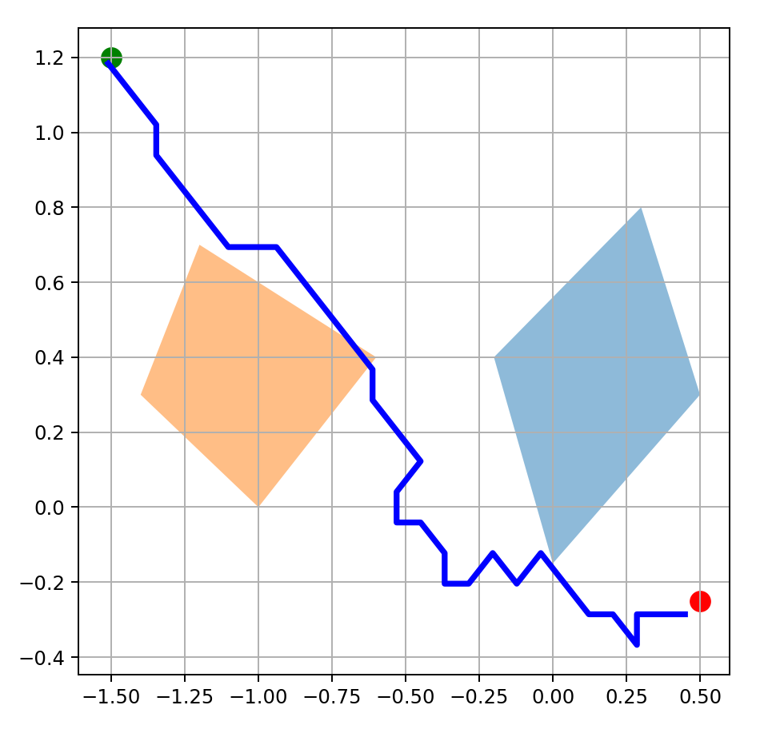
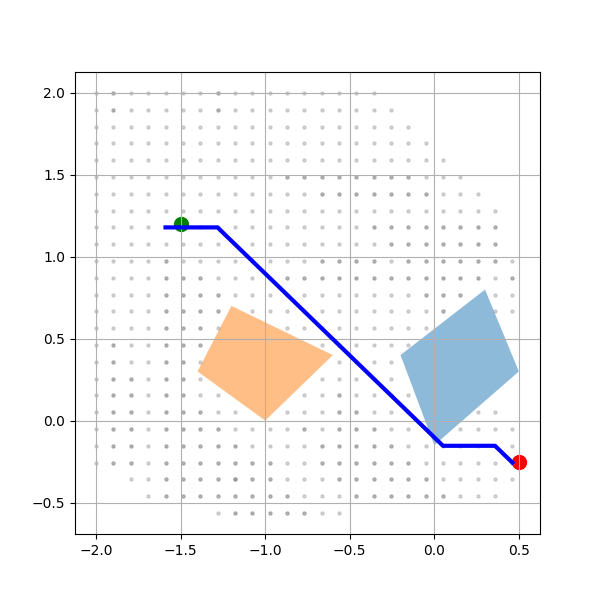
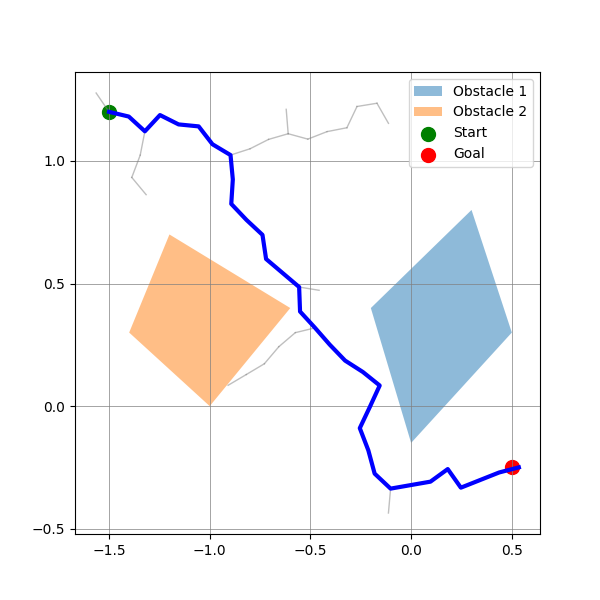
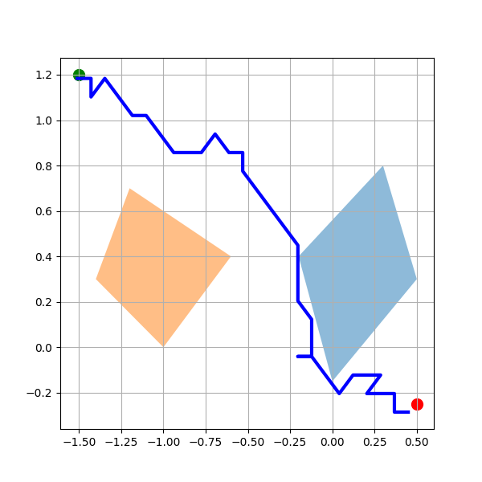

# 🚀 Adaptive Iterative Feedback Prompting (AIFP) for Obstacle-Aware Path Planning via LLMs

## 📜 Overview

This repository contains the code and dataset for the paper:

**"Adaptive Iterative Feedback Prompting for Obstacle-Aware Path Planning via LLMs."**

### 📌 Abstract

Planning is a critical component for intelligent agents, especially in **Human-Robot Interaction (HRI)**. Large Language Models (**LLMs**) demonstrate potential in planning but struggle with **spatial reasoning**. This work introduces **Adaptive Iterative Feedback Prompting (AIFP)**, a novel framework that improves **LLM-based path planning** by incorporating **real-time environmental feedback**. AIFP prompts an LLM iteratively to generate partial trajectories, evaluates them for **collision detection**, and refines them when necessary using a **Receding Horizon Planning (RHP) approach**.

## 🔑 Key Features

✅ **LLM-based path planning** with adaptive feedback  
✅ **Collision-aware trajectory generation**  
✅ **Iterative re-planning mechanism** using **Receding Horizon Planning (RHP)**  
✅ **Handles static and dynamic obstacles**  
✅ **Improves success rate by 33.3% compared to naive prompting**  
✅ **Fully implemented with OpenAI's GPT-4 API**  

✅ **A star and RRT planners in the same 2D domain**  

## 📂 Repository Structure

```
├── src/                   # Source code for AIFP framework
│   ├── aifp_planner.ipynb              # Core implementation of AIFP
│   ├── naive_llm_planner.ipynb         # A naive llm planner
│   ├── astar_planner.py                # A* Planner in the grid version of same 2D domain
│   ├── rrt_planner.py                  # RRT Planner in the same 2D domain
├── results/               # Outputs of path planning trials
├── README.md              # This README file
└── requirements.txt       # Required Python dependencies
```

## 🛠 Installation & Setup

### 1️⃣ Clone the repository:
```bash
git clone https://github.com/yourusername/AIFP-PathPlanning.git
cd AIFP-PathPlanning
```


## 📊 Experimental Results

| Environment         | AIFP Success Rate (%) | Naïve Prompting (%) |
|--------------------|---------------------|--------------------|
| Single Obstacle   | **55.6%**            | 22.3%             |
| Double Obstacles  | **36.7%**            | 14.0%             |
| Random Obstacles  | **31.5%**            | 12.5%             |
| Moving Obstacle   | **48.5%**            | N/A               |
| Moving Goal       | **51.5%**            | N/A               |

✔️ **AIFP significantly outperforms naïve prompting**, especially in static environments! 🚀

## 📌 Citation

If you use this work, please cite:

```
@article{AIFP2025,
  title={Adaptive Iterative Feedback Prompting for Obstacle-Aware Path Planning via LLMs},
  author={Masoud Jafaripour, Shadan Golestan, Shotaro Miwa, Yoshihiro Mitsuka, Osmar R. Zaiane},
  year={2025},
  Conference={AAAI LM4Planning Workshop}
}
```

## 🏗️ Future Work

- 🔹 Extend AIFP to **3D navigation tasks**  
- 🔹 Integrate **Vision-Language Models (VLMs)** for richer environmental perception  
- 🔹 Explore **graph-based path representations** for improved trajectory optimization  

---

🚀 **Star** ⭐ this repo if you find it useful!  
📧 Feel free to submit issues, PRs, or suggestions.

**this repo is being updating.**

---

## 🖼️ Qualitative Planner Comparisons

The following visualizations compare **LLM-based**, **learning-based**, and **classical planners** under identical start–goal and obstacle configurations.  
All figures are shown at a **fixed size** with **compact captions** for consistent visual comparison.

### 🤖 LLM-Based and Hybrid Planners

<p align="center">
  <div style="display:inline-block; text-align:center; margin:8px;">
    
    <div><sub><b>AIFP</b>: Adaptive Iterative Feedback Prompting</sub></div>
  </div>
</p>

---

### 🧠 Learning-Based Planners

<p align="center">
  <div style="display:inline-block; text-align:center; margin:8px;">
    
    <div><sub><b>Q-learning</b>: Handcrafted reward</sub></div>
  </div>

  <div style="display:inline-block; text-align:center; margin:8px;">
    
    <div><sub><b>Q-learning</b>: LLM-designed reward</sub></div>
  </div>
</p>

---

### 📐 Classical and Sampling-Based Planners

<p align="center">
  <div style="display:inline-block; text-align:center; margin:8px;">
    
    <div><sub><b>A*</b>: Grid-based shortest path</sub></div>
  </div>

  <div style="display:inline-block; text-align:center; margin:8px;">
    
    <div><sub><b>RRT</b>: Sampling-based planner</sub></div>
  </div>

  <div style="display:inline-block; text-align:center; margin:8px;">
    
    <div><sub><b>MCTS</b>: Tree search planner</sub></div>
  </div>
</p>

---

### 🔍 Observations

- **AIFP** refines trajectories via iterative feedback and collision checking.
- **LLM-informed reward learning** biases learned paths toward smoother, goal-directed behavior.
- **Classical planners** offer strong geometric baselines but lack semantic adaptability.

All planners are evaluated in the same 2D environment with identical obstacle layouts.
